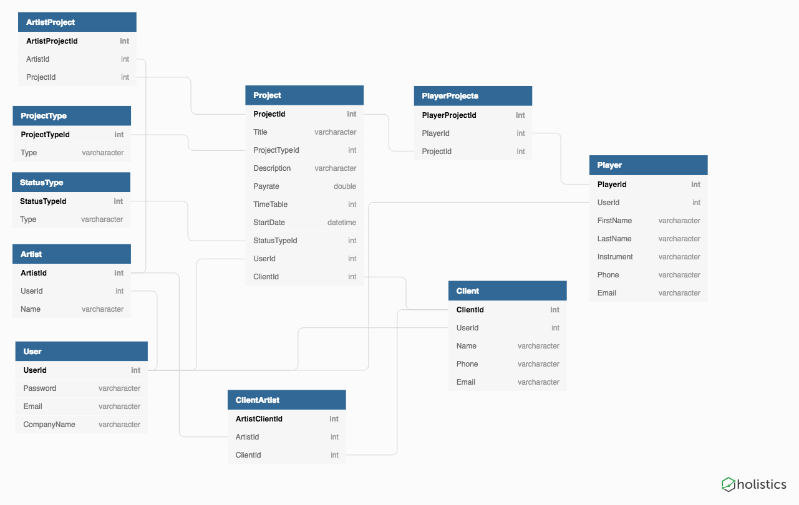

# Studio-Metrics

## What is Studio Metrics?
This is a project management app directed toward sound engineering studios as the intended audience. The application is intended
to be an internal application for the employees at the studio. Studio Metrics allow the studio to create and store their data for
their Projects, Clients, Artists and In-House Players. The Projects tab of the application breaks the projects down into tabs regarding
the status of the project allowing the user to easily access their projects and move them as needed.

## Technologies Used
* C #
* .NET
* Entity
* Identity
* [Canva](https://www.canva.com/) - Design site used to make the Logo

## How to Start
To run Studio Metrics on your local computer
1. First you will need to clone or fork this repository
2. Then you must run a `dotnet restore` from your terminal within the project folder
3. After this you must run `Update-Database` in the Package Manager Console

## Data Structure

